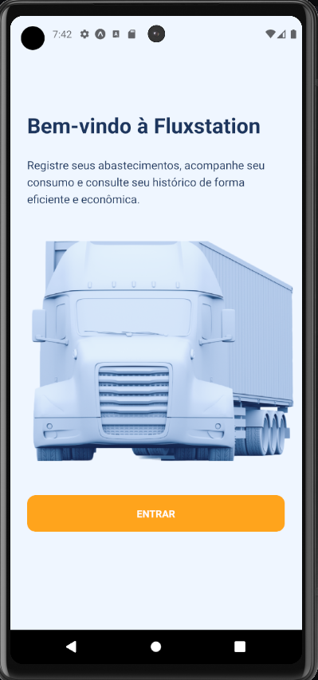
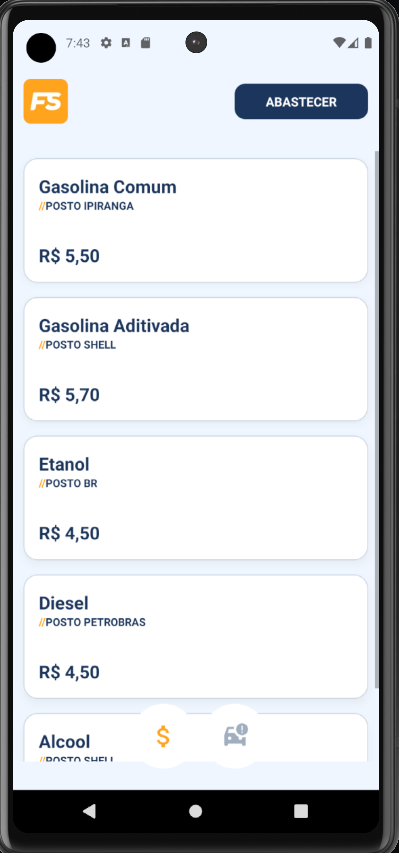
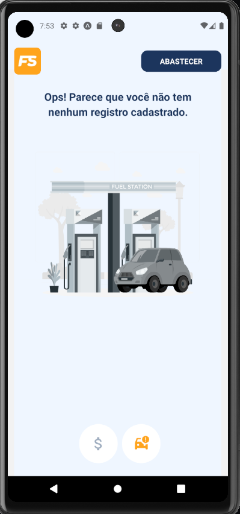
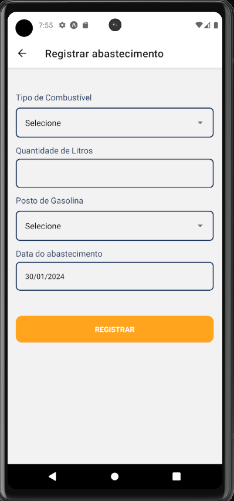
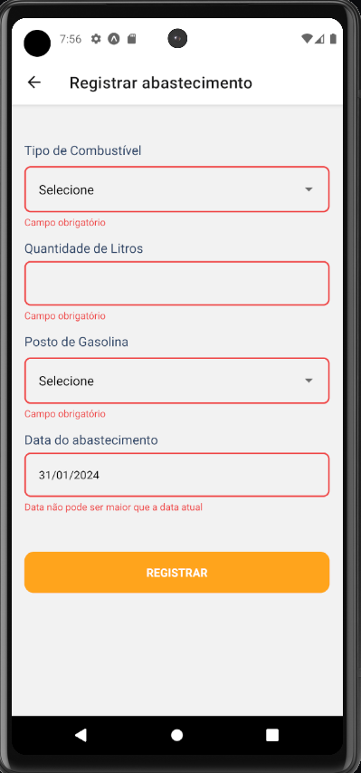
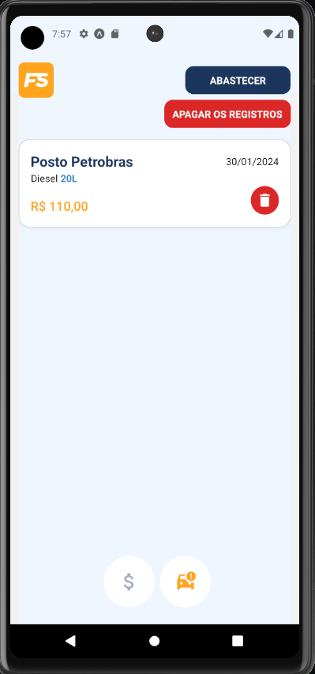

# Fluxstation

Teste frontend para App Masters,

Aplicativo com o objetivo de gerenciar abastecimentos de motoristas.


# Layout

## Página Inicial

[]()

## Lista de Combustíveis

[]()

## Registros vazios

[]()

## Form

[]()

## Form Inválido

[]()

## Lista de registros

[]()


## Requisitos

1. Registro de Abastecimento:
- ✅ Os motoristas devem ser capazes de registrar um abastecimento de
combustível, fornecendo a quantidade de litros e o tipo de combustível
(Gasolina, Etanol, Diesel, etc.).
- ✅ O sistema deve calcular o valor total do abastecimento com base nos preços dos
combustíveis.
- ✅ Os abastecimentos devem ser armazenados em um histórico para cada
motorista.


2. Histórico de Abastecimentos:
- ✅ Os motoristas devem poder visualizar seu histórico de abastecimentos, listando
as informações de cada registro, incluindo a data do abastecimento.


## Tecnologias utilizadas

- React Native
- Typescript
- Javascript
- Tailwindcss
- Nativewind
- React Hook Form
- Zod
- Expo
- Expo router


## Rodando Localmente

```bash
$ git clone https://github.com/zkauansantos/fluxstation.git

$ cd fluxstation

$ yarn 

$ npx expo install

$ npx expo start 
```

Depois selecione a plataforma ou scaneie o QRcode